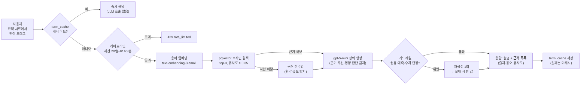

# RAG 구조 설명 (심사 질의응답 대비)

> 심사 기준: "RAG 등 최신 기술 활용 시 **어떻게 동작하는지 설명할 수 있어야** 가점."
> 이 문서 하나로 답변 가능하게 정리한다. 발표 슬라이드에는 아래 다이어그램을 옮겨 쓴다.

## 한 문장 요약

**"한국은행이 공식 발간한 「경제금융용어 700선」을 벡터DB(pgvector)에 넣어 두고, 사용자가
모르는 단어를 드래그하면 그 용어집에서 가장 가까운 정의를 찾아 근거로 삼아 설명합니다.
답변에 어떤 근거를 썼는지(출처·유사도)도 응답에 그대로 노출합니다."**

## 무엇을 적재했나 (지식베이스 구성)

| 소스 | 건수 | 출처 |
| --- | --- | --- |
| 경제금융용어 700선 | 685건 (98.9% 파싱) | 한국은행 공식 발간물(2020) — `data/bok_700.json` |
| 국내 공시유형 해설 | 12건 | 자체 작성 — `data/disclosure_form_types.json` |
| 미국 폼(8-K 등) 해설 | 4건 | 자체 작성 — 동일 파일 |

- 청킹: **용어 1건 = 청크 1개** (정의가 200~900자라 추가 분할 불필요 — 의미 단위 보존)
- 임베딩: OpenAI `text-embedding-3-small` (1536차원), 입력은 `용어명\n정의`
- 저장: PostgreSQL **pgvector** — 서비스 DB와 같은 DB라 인프라 추가 없음

## 동작 파이프라인 (용어 풀이, F-5.4)

## 예상 질문과 답

- **왜 RAG를 썼나? 그냥 LLM에 물어보면 안 되나?**
  → 금융 용어는 LLM이 그럴듯하게 틀리기 좋은 영역이다. 한국은행 공식 정의를 근거로 주입하면
  ① 환각이 줄고 ② "설명의 출처가 한국은행"이라는 신뢰를 사용자에게 보여줄 수 있다(서비스
  콘셉트인 공공 데이터 신뢰와 일치). 응답의 `sources` 필드가 그 증거다.

- **벡터DB는 뭘 썼나?** → pgvector. 서비스 DB(PostgreSQL)에 확장으로 얹혀서 별도 인프라 없이
  코사인 검색이 된다. 701청크 규모라 인덱스 없이도 밀리초 단위다.

- **유사도 하한은 왜 두나?** → 관련 없는 근거를 억지로 주입하면 오히려 오답을 유도한다.
  0.35 미만이면 근거 없이 생성하되, 프롬프트가 "모르면 모른다고 답하라"로 방어한다.

- **임베딩 비용은?** → 701청크 전체 적재에 수백 원 수준. 검색 시엔 용어 1개만 임베딩한다.

- **환각·투자 권유는 어떻게 막나?** → ① 근거 주입 ② 프롬프트에서 정의까지만 허용
  ③ 규칙 기반 가드레일(권유·예측·수치 단정 정규식) 위반 시 재생성 1회 후 폐기 — 3중 방어.

## 코드 위치

| 역할 | 파일 |
| --- | --- |
| 700선 PDF 파싱(1회성) | `scripts/parse_bok700.py` → `data/bok_700.json` |
| 임베딩·적재 | `scripts/seed_knowledge.py` |
| 벡터 검색 | `app/ai/rag.py` (`search_knowledge`) |
| 용어 풀이 생성 | `app/ai/term_explain.py` |
| API 엔드포인트 | `app/routers/terms.py` (`POST /terms/explain`) |
| 레이트리밋 | `app/services/ratelimit.py` |
