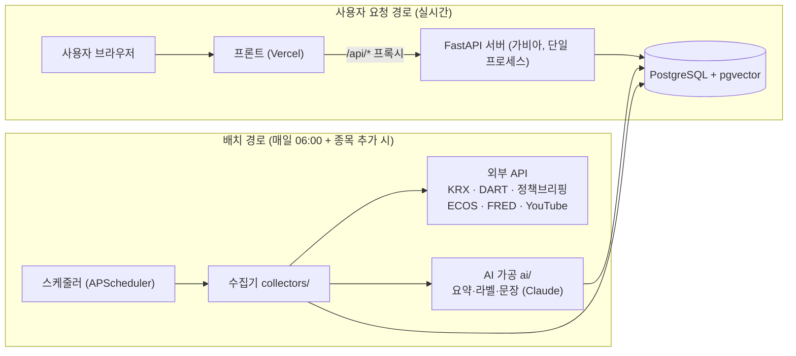
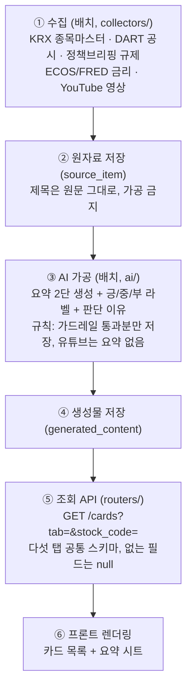
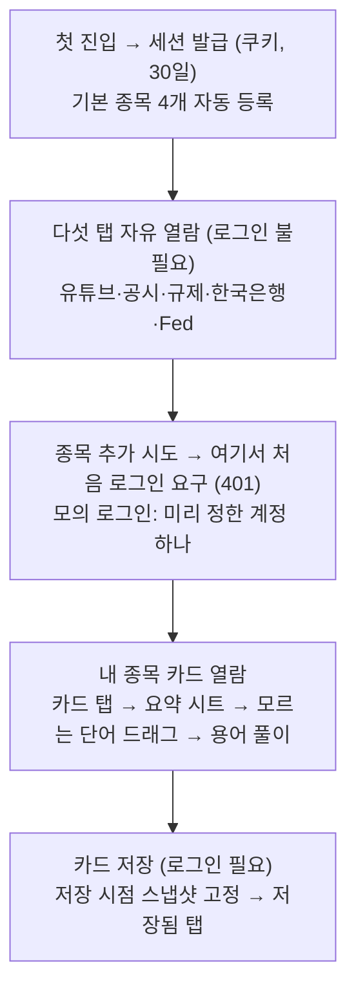

# assit 시스템 아키텍처

팀 번개조 | 2026.08 | 코드를 처음 보는 팀원용 — 상세 명세는 `assit_요구사항명세서_v2.1.md`, 일정은 `개발계획서.md`

---

## 1. 한 장 요약

**대상은 국내 상장 주식(KOSPI·KOSDAQ)만이다.** 해외 종목은 명세상 범위 밖(검색에서 제외하고 `unsupported_overseas` 안내만).



**가장 중요한 설계 원칙 (CLAUDE.md 불변식 1):** 위 두 경로는 분리되어 있다. 사용자가 화면을 여는 순간에는 **DB만 읽는다** — 외부 API도 LLM도 부르지 않는다. 수집과 AI 생성은 전부 배치에서 미리 끝내 DB에 저장해 둔다. 그래서 시연 중 외부 API가 죽어도 화면은 멀쩡하다. (유일한 예외: 용어 풀이 `POST /terms/explain` — 사용자가 단어를 드래그하는 순간 LLM 1회 호출)

## 2. 데이터가 흐르는 순서



RAG(F-4.8)는 ③에 끼어든다: 용어 풀이·공시 요약을 생성할 때, 미리 임베딩해 둔 지식베이스(한국은행 경제금융용어 700선 + DART 공시유형 해설)에서 관련 내용을 검색해 프롬프트에 근거로 넣는다.

## 3. 사용자 기능 흐름 (PRD 시나리오 기준)



로그인이 관문이 아니라는 것, 데이터가 계정이 아닌 **세션**에 붙는다는 것이 구조의 핵심이다(시연용 단일 계정이라 계정에 붙이면 관객끼리 데이터가 섞인다).

## 4. 코드 구조 ↔ 기능 매핑 (진행 상태 포함)

| 디렉터리/파일 | 역할 (스프링 대응) | 담당 기능 | 상태 |
| :---- | :---- | :---- | :---- |
| `app/main.py` | 앱 조립 (Application 클래스) | 앱 생성·라우터 등록·기동 시 DB 초기화 | ✅ P0 |
| `app/config.py` | application.yml | .env 환경 변수 로드 | ✅ P0 |
| `app/db.py` | DataSource + JPA 설정 | DB 연결, 세션 주입, pgvector 초기화 | ✅ P0 |
| `app/models.py` | @Entity | 테이블 13개 (명세 부록 1) | ✅ P0 |
| `app/errors.py` | @ControllerAdvice | 에러 응답 규격 {code,message,details} (F-7.1) | ✅ P0 |
| `app/routers/` | @RestController | health ✅ / session·stocks·cards·terms·saved·admin (P1~P5) | 🔜 |
| `app/services/` | @Service | industry(업종 분류) ✅ / 나머지 (P1~P5) | 부분 |
| `app/collectors/` | 외부 연동 클라이언트 | krx ✅ 실행검증 / dart ✅ 코드만(키 대기) / briefing·ecos·fred·youtube (P3) | 부분 |
| `app/ai/` | — | 요약·라벨·문장·용어풀이·가드레일·RAG (P4~P5) | 🔜 |
| `app/scheduler.py` | @Scheduled | 일 06:00 배치 골격 ✅ (수집 잡은 P3에서 추가) | 부분 |
| `data/` | — | 업종 12분류·부처 매핑·성격 서술 (코드 아닌 데이터) | ✅ P0 |
| `scripts/` | CommandLineRunner류 | 종목 동기화 ✅ / corpCode(키 대기) / 지식베이스 적재 (P5) | 부분 |

## 5. 지금 DB에 있는 데이터

| 테이블 | 내용 | 건수 | 출처 |
| :---- | :---- | :---- | :---- |
| `stock_master` | 국내 상장 종목 (코드·이름·시장·업종·시총) | 2,713 | KRX (FinanceDataReader, 키 불필요) |
| `industry_ministry` | 12분류 + 소관 부처 + 업종 성격 | 13 | 팀 작성 데이터 (`data/`) |
| 나머지 11개 테이블 | 스키마만 생성됨 (빈 상태) | 0 | P1~P5에서 채워짐 |

별도로 "다운로드해야 할 데이터셋"은 없다. 원자료(공시·규제·금리·영상)는 P3에서 API로 수집하고, RAG 지식베이스(경제금융용어 700선)는 P5에서 공개 자료를 1회 적재하며, 금통위 결정 요지만 수동 시드로 넣는다(연 8회 자료).

## 6. 남은 길 (개발계획서 P1~P6 요약)

```
P1 세션·종목 API ──→ P2 /cards 스키마 목 응답 (프론트 합류 지점)
                                │
P3 수집기 5종 + 배치 ──→ P4 AI 가공(요약·라벨·문장) ──→ P5 RAG·용어풀이·저장
                                                              │
                                              P6 배포·검수 잠금·캐시 워밍·리허설
```
